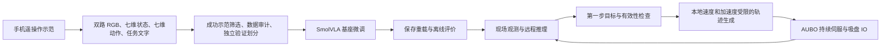

# AUBO i10 竹条抓取 SmolVLA 阶段实验汇报

日期：2026-09-23。范围：七维关节路线的数据采集、模型微调、离线评价和有人值守的真机试验。截至本次汇报，按操作者要求暂停后续推理实验。

## 1. 实验目标与阶段结果

本实验希望机械臂根据双路相机图像、任务文字及当前关节状态，自主完成单根竹条的接近、吸附、提起、搬运和放置。核心路线是 SmolVLA 模仿学习：人通过手机遥操作提供示范，模型学习示范中的观测与动作关系，再在真实场景中持续根据新观测调整动作。

目前完成了 60 条训练示范、12 条独立验证示范的准备，以及一个 SmolVLA 检查点的 20,000 步微调、保存重载与离线评价；随后建立了七维关节在线执行链路，并逐步改为持续伺服。操作者确认：六种示范角度均已抓取成功，最新随机角度试验也成功。最新录像抽查可见竹条从抓取区被带到收集区，日志显示吸盘指令周期正常完成。

这些结果说明当前方案已取得受控场景下的真机抓放成功案例，但尚未形成按角度、位置和重复次数统计的成功率。不能写成“任意角度稳定抓取”或“成功率 100%”。本汇报依据本地实际代码、保存的训练证据副本、试验日志、录像抽查和操作者现场反馈整理；未重新启动远端模型、训练或机器人。

## 2. 基础概念与系统结构

**VLA（Vision-Language-Action，视觉—语言—动作模型）**把图像、任务文字与机器人状态组合起来，输出动作。当前只训练和使用一句固定任务文字：`Pick one strip and place it in the collection area.`，因此不能据此声称支持任意自然语言任务。

**模仿学习**是通过专家示范学习动作。本实验在已有 SmolVLA 基座上微调，并非从零训练模型，也没有进行强化学习。

**关节空间**用六个电机轴的角度描述机械臂姿态。当前契约为 `AuboI10JointLegacyTeleopV2`，状态和动作均为七维：

`[J1, J2, J3, J4, J5, J6, gripper_pos]`

其中六个关节使用度，吸盘指令为 0（释放）或 100（吸附）。J5 参与模型预测，不是此前固定 J5=90° 的六维方案。动作是绝对关节目标，不是关节增量，也不是旧 C0 路线的末端 TCP 动作。TCP 指工具中心点，其位置在当前推理链路中用于工作区和速度检查，不作为模型的动作表示。

模型一次输出 `[50,7]` 动作块，即 50 个未来动作目标；按示范的 25 Hz 名义采样率，对应约 2 秒。在线每次采用其中第一步，然后根据新观测重新预测。实际发送的是轨迹生成器生成的中间目标，因此既不是一次执行完 50 步，也不是原始模型轨迹的逐值重放。

硬件与图像配置使用 `configs/aubo_i10/CameraSetV2.json`：固定全局相机 `global_rgb` 和腕部相机 `grasp_rgb`，两路均为 640×480 RGB；相机配置分别为 30 FPS 和 25 FPS。数据记录及本地运动命令的目标频率为 25 Hz。相机帧率、模型预测频率和运动发送频率是三个不同概念。

## 3. 数据采集与整理

### 3.1 示范如何形成训练数据

沿用旧手机遥操作习惯：手机控制平移，遥操作内部通过逆运动学计算关节目标，J6 保留原有转动操作，吸盘由人工切换。每条示范包含接近、对准、吸附、提起、搬运和释放。

记录的 `observation.state` 是当前关节及吸盘指令历史；`action` 使用控制器接受的关节目标和吸盘指令。两者不能混同：把实测关节位置当作动作标签，可能把执行器滞后也学进去。进入 SDK 时才将关节角从度转换为弧度。

每条示范填写场景编号、摆放参考和实际结果。保留失败或中断的记录，但训练筛选成功示范；另外检查数据结构、动作发送证据、时间戳、保存状态和完整吸盘开关周期。`gripper_quality_passed` 表示吸盘标签质量检查通过，不能代替人工确认物理吸附成功。

### 3.2 实际数据规模

以下按本轮保存的数据来源记录统计，不按目录名称推断数量。

| 训练摆放角度 | 示范条数 | 帧数 | 场景编号 |
| --- | ---: | ---: | --- |
| 0° | 10（4+6） | 7,934 | 001 |
| 45° | 10（5+5） | 8,586 | 002 |
| 67.5° | 10 | 8,498 | 003 |
| 90° | 10 | 7,536 | 004 |
| 135° | 10 | 7,070 | 005 |
| 157.5° | 10 | 7,435 | 006 |
| 合计 | 60 | 47,059 | 001～006 |

验证集为另行录制的 12 条、9,316 帧，场景编号 007。操作者确认重新摆放并改变位置，训练与验证场景编号没有交集。独立录制减少了直接复用训练场景的问题，但不等于覆盖了所有未知角度、位置和光照。

0° 和 45° 先前批次没有录满计划条数，后续分别补录 6 条和 5 条。原始批次的 `capture_complete=false` 被保留，没有改写为完整；通过 `sources.json` 显式组合八个训练来源。各来源先构造不跨条目的动作块，再组合训练，保留原始条目及旁证。

### 3.3 归一化与数据一致性

归一化是将不同量纲、不同范围的数值转换到适合训练的尺度。当前状态和动作采用均值／标准差归一化，只从选中的成功训练帧计算统计，验证集不参与统计计算。预测后使用配套处理器恢复为关节角和吸盘分数。

训练前检查契约、场景划分和数据来源哈希；保留原始 Parquet、视频及采集旁证。旧六维固定 J5 数据、旧 TCP 数据与当前七维数据不混用。吸盘必须在录制结束前完成释放，录制外的释放不会自动成为训练标签。

## 4. 模型准备与正式训练

### 4.1 从基座适配到 AUBO

使用本地缓存的 `lerobot/smolvla_base`，配套视觉语言模型为 `SmolVLM2-500M-Video-Instruct`。适配器显式指定两路图像、七维状态和七维绝对动作，关闭 Aloha 专用动作变换。模型内部有更宽的填充维度，外部 AUBO 契约始终为七维。

训练准备先完成合成输入的前向、反向和保存重载检查，再使用真实数据批次验证数据加载、输出形状及吸盘相关梯度。准备检查中优化器更新为零，其作用是检查训练链路能否正确工作，不作为模型能力结论。

### 4.2 实际训练配置

| 参数 | 本轮设置 |
| --- | --- |
| 运行名称 | `joint_legacy_v2_run01` |
| 训练设备 | 远端 CUDA；部署记录为 RTX 4090 D |
| 正式优化步数 | **20,000**，早期 10,000 步准备方案后来经授权调整 |
| 批大小 / 随机种子 | 8 / 42 |
| 动作块长度 / 在线取用步数 | 50 / 1 |
| 模型采样步数 | 10；与训练优化步数含义不同 |
| 优化器 | AdamW，基础学习率 `1e-4` |
| 学习率调度 | 前 1,000 步预热，其后按实际 20,000 步计划余弦衰减，末值 `2.5e-6` |
| 梯度裁剪 | 范数上限 10，限制过大的参数更新 |
| 训练方式 | 配置采用冻结视觉编码器、训练动作专家及状态投影；不是全部参数从零训练 |
| 动作表示 | 六个绝对关节角与吸盘指令 |
| 保存方式 | 最终检查点，保存处理器、契约、来源记录与训练状态 |

执行入口是 `examples/phone_to_auboi10/train_joint_smolvla.py`，阶段包括 `plan`、`preflight`、`smoke`、`train`、`evaluate`。正式启动脚本使用独立部署目录和已有虚拟环境；启动前检查 GPU 占用，避免干扰其他计算任务。没有在本轮报告整理中再次联网核对远端环境。

训练时，处理器构造模型输入，模型计算训练损失，反向传播得到梯度，然后经裁剪、优化器更新和学习率调度完成一个优化步。这里的 loss 是模型训练目标的数值，并不直接等于抓取失败率。

### 4.3 已完成的训练结果

本次重新读取本地保存的 `training.jsonl`：连续记录 1～20,000 步。

| 指标 | 结果 |
| --- | ---: |
| 训练循环耗时 | 6,323.04 秒，约 105.38 分钟 |
| 第一步 loss | 1.098910 |
| 最后一步 loss | 0.020813 |
| 最后 1,000 步平均 loss | 0.025429 |
| 验证 loss | 0.044983 |
| 自动严格保存重载 | 通过，重载预测逐值一致，形状 `[8,50,7]` |

耗时仅指日志记录的训练循环，不包含全部准备、加载和后续验证。损失下降说明训练目标得到了优化，不能单独证明机器人会抓取。

远端检查点位置：

`gpu:/home/rentao/program/lerobot-aubo-smolvla-joint-legacy-v2-20260922/outputs/joint_legacy_v2_run01/final`

保存的模型 SHA-256 与现场推理计划所用标识一致：

`95a596e2a98dbe60623f801b2d12a6028132ad321a0bcb2ac7ae334ef5613aad`

## 5. 离线评价及其解释

离线评价把专家录制的图像和状态交给模型，看第一步预测与专家目标有多接近。它不包含模型自主运动产生的新状态，因此不能代替闭环真机试验。

MAE（平均绝对误差）表示逐帧预测与目标之差的绝对值再求平均。与“直接复制当前关节角”这个简单基线比较：

| 关节 | 模型 MAE / 度 | 复制当前角度 MAE / 度 |
| --- | ---: | ---: |
| J1 | 0.3167 | 0.5920 |
| J2 | 0.1344 | 0.2523 |
| J3 | 0.1598 | 0.2267 |
| J4 | 0.1573 | 0.2662 |
| J5 | 0.0106 | 0.0212 |
| J6 | 0.5730 | 0.5596 |

五个关节优于简单基线，J6 略差。平均误差会掩盖抓取关键帧的误差，不能直接转换为吸盘对准精度。

吸盘原始分数使用固定阈值 50 转换为 0/100。严格要求与专家同一帧切换时，开启命中 1/12（8.33%），释放命中 0/12；总体准确率为 99.27%。总体准确率看起来很高，是因为 9,316 帧中仅有 24 个切换帧，大部分只需保持状态，复制当前吸盘状态甚至可达到 99.74%。

随后读取事件前后窗口发现，20/24 个事件在专家切换前 25 帧内曾出现同方向预测，开启和释放各 10/12；45 个“保持帧误切换”全部集中在提前窗口。这修正了“模型完全不会主动切换”的过强解释，但这些预测多为短暂片段，也不能证明时机可靠。专家切换后的下一帧输入状态已经变化，模型跟随新状态不等于自主触发了切换。

处理方式是核对标签与真实指令帧、区分精确帧指标和事件窗口，不直接通过调阈值或增加训练步数掩盖问题。早期离线验收保留了不进入执行的判断；后续经单独授权、补齐执行链路并逐级开展真机试验，才获得新的物理成功证据。历史评价与后续试验有不同条件，不能互相覆盖。

## 6. 从离线模型到持续伺服

### 6.1 分阶段建立执行能力

已有 ACT 入口和旧 TCP 安全检查不适用于七维 SmolVLA。为此建立独立入口，先做只读观测与预测检查，再进行静态单步、短段闭环，最后才进入完整抓放。旧录制流程和旧路线保留，不通过替换一个模型路径强行复用不兼容的动作协议。

### 6.2 减少图像传输耗时

最初使用无损 RGB 压缩，保存场景对比显示单次请求约 1.47 MB，往返中位数约 299.63 ms。改为 JPEG 质量 95 后约 0.273 MB，中位数约 141.85 ms。五组相同随机种子的配对比较中，最大关节预测差异约 0.09958°，吸盘开关判断一致。

因此保留 JPEG95 和正确的 RGB 通道／相机角色映射；不启用收益较小的快速矩阵计算作为正式默认。该比较只覆盖一个保存场景，不能声称有损编码对所有场景的预测完全无影响。

### 6.3 持续伺服与动作平滑

早期逐步停止入口每次执行后等待停稳，导致运动顿挫。当前 `run_joint_smooth.py` 使用后台单线程做远端推理，本地主线程独占机器人 RPC，并以目标 25 Hz 生成运动命令。一轮只开启一次伺服，结束时关闭。

轨迹生成器根据当前参考位置、参考速度和模型目标，限制关节速度、加速度以及 TCP 位移。这样即使模型目标较远，也能逐步接近。模型目标检查与实际中间命令检查分开：前者检查有效数值、控制器关节限位和工作区，后者额外检查相对实测关节的跟踪误差。

吸盘切换保持离散：模型提出开关要求后，暂时保持相应关节目标，待关节误差和参考速度足够小再写 IO，随后获取新观测。正常结束条件是完成开启→释放的指令周期，没有真空传感器自动证明吸附成功。

## 7. 主要问题、原因与处理

| 问题或现象 | 证据与原因判断 | 处理及当前边界 |
| --- | --- | --- |
| 动作表示和旧入口不匹配 | 当前是七维绝对关节，旧 ACT／C0 使用不同接口与动作语义 | 建立独立采集、训练适配和执行入口；J5 参与预测，避免混用旧数据 |
| 采集批次未录满 | 0°、45° 原批次分别只有 4、5 条 | 用新目录补录并显式列出数据来源，不改写旧批次完成标志 |
| 吸盘总体准确率高、精确切换命中低 | 类别严重不均衡；窗口内存在提前信号 | 检查事件窗口与指令标签，不将总体准确率或下一帧跟随当作主动抓放能力 |
| 远端推理链路慢 | 大图像包与编码耗时占据预算，不能全归因于模型 | JPEG95 配对验证后采用；正式默认未叠加快速矩阵计算 |
| 运动停停走走 | 逐步执行、反复停稳及切换伺服 | 改为异步推理与本地持续伺服；操作者反馈连续性改善 |
| 模型较远目标被 1°／3° 等门限反复拒绝 | 把模型目标距离与一次实际发送步长混为一谈 | 取消原始模型目标的 3°／50 mm 距离限制；保留实际中间命令 3° 跟踪误差、限速、关节限位与工作区检查 |
| 归位拒绝或过慢 | 完整 moveJoint 归位不适合使用模型单步距离门限；旧 20 秒超时证据不足 | 移除归位 10°门限，采用 80°/s²、60°/s、50%速度比例及按距离估计的超时，增加过程日志并恢复原速度比例 |
| 偶发 camera skew | 一轮双相机时间差约 50.327 ms，略超旧 50 ms | 按现场选择将门限改为100 ms；撤回跳帧重取方案。并非实现了硬件同步 |
| RPC request timeout | `235034_121373` 首个异常定位到 `getSafetyModeType` | RPC等待100→300 ms，减少重复状态读取，增加异常栈；不对运动指令自动重试 |
| TCP 限速与关节加速度冲突 | `235754_796241`：先限制加速度，再将速度向零缩放，可能突破允许减速度 | 在可达减速速度与期望速度间做6次有界搜索，逐候选检查FK；无可行候选仍停止。已提交 `a593bbd` |
| 新预测被判过期 | `001844_212736` 输入到接收约362 ms，旧上限300 ms；模型约99 ms、往返约318 ms | 经授权将接收年龄300→400 ms；网络／调度波动具体来源未唯一定位 |
| 500 ms没有新鲜预测 | `003421_201077` 接受91次预测后停止；末次已返回请求约141 ms，末段两路录像出现约240 ms缺失采样补帧 | 提示本地调度或采集停顿，但没有逐调用耗时证明根因；经授权将无新鲜预测期限500→600 ms，接收年龄仍400 ms |
| 随机角度第一次抓空 | `002221_894016` 无运行异常，接触画面偏侧和倾斜；开启前最大关节目标误差约0.108°，竹条未被带走 | 支持精细对准偏差的判断；未证明只由角度引起，也未改模型。后续随机角度出现成功，尚不能据此判定稳定性 |

FK（正运动学）表示从关节角计算 TCP 位置。上述限速修复保留原速度和加速度上限，常规周期约2次FK，限速周期最多9次；不是全局最优轨迹求解器，仍可能保守拒绝。回归测试中的历史故障复现使用局部替代运动学，不能写成精确真机轨迹重放。

将500 ms放宽至600 ms，只增加对短时没有新结果的容忍度，也允许旧目标多使用100 ms。它没有更新权重或修正抓取角度。随机角度成功发生在修改之后，不构成“放宽门限使模型学会新角度”的因果证据。

## 8. 最新试验与现场结果

| 试验目录后缀（2026-09-23） | 运行记录 | 物理结果或解释 |
| --- | --- | --- |
| `002221_894016` | 1,943帧命令、476次预测，完成吸盘周期，无异常 | 操作者报告随机角度失败；此前双路录像抽查显示竹条仍留在抓取台 |
| `003421_201077` | 364帧、91次预测，500 ms时效保护停止 | 吸盘尚未开启，不作为完整抓取能力试验 |
| `003909_913867` | 1,955帧、479次预测，600 ms配置，正常完成周期 | 本次只核对运行日志，不单独标注现场成功结果 |
| `004148_090633` | 2,006帧、494次预测，600 ms配置，正常完成周期 | 最新录像关键帧可见竹条被搬到收集区；操作者本轮反馈随机角度成功 |

最新轮次首末命令跨度约80.535秒；双路录像各2,026帧、约81.04秒。最终记录为静止、伺服关闭、吸盘指令0。录像完整、编码队列丢帧为0，两路各有1次读取缺失并存在补帧，因此25 FPS输出不代表每帧都是独立曝光。

“六种示范角度均成功”和“本次随机角度成功”作为操作者现场反馈记录；没有为原始 `complete.json` 的 `physical_grasp_success=null` 回填推测结果。录像抽查提供辅助物理证据，但尚未逐条建立全部角度与成功次数的对应清单。

## 9. 当前运行参数与验证范围

| 项目 | 当前参数 |
| --- | --- |
| 本地目标发送频率 | 25 Hz，DT=0.04秒 |
| 关节指令速度／加速度 | 5°/s、20°/s² |
| TCP指令速度 | 0.05 m/s |
| 中间指令跟踪误差 | 3° |
| 接收预测的输入年龄上限 | 400 ms |
| 普通运动无新鲜预测期限 | 600 ms，从最近接受预测的最早输入观测时间计算 |
| 相机时间差上限 | 100 ms |
| RPC等待／控制循环间隔上限 | 300 ms／350 ms |
| 发送前当前状态新鲜度 | 100 ms |
| 吸盘切换条件 | 最大关节目标误差<0.15°、参考速度<0.3°/s，最多等待1.5秒 |
| 单轮时限 | 120秒 |
| TCP工作区 | x[-0.8,1.0]、y[-1.2,0.0]、z[0.0,0.8]米 |

吸盘IO切换后，代码为获取切换后的新观测设置一次独立等待期限；不改写已有输入时间戳。异常退出不自动释放吸盘，不自动归位。工作区检查不是全臂避障，25 Hz目标也不是严格实时保证。

最近一次针对 `test_joint_trial.py`、`test_joint_smooth.py`、`test_joint_video.py` 的回归检查为 **73 passed**，`git diff --check` 通过。测试证明相关软件行为满足断言，不等同于全项目验收或真实抓取成功率。

本次整理时分支为 `research/depth-vla-phase-a`，HEAD为 `a593bbd`；此前 `8809b07` 保存七维训练和试验链路。400 ms预测年龄、600 ms无新鲜预测期限及配套测试／文档修改仍在工作区，未因本次汇报提交或覆盖。

## 10. 阶段认识与后续安排

本轮的主要工程收获是打通了“示范数据—模型微调—检查点验证—现场观测—受限执行—日志录像复核”的完整链路。训练质量、通信时效、运动轨迹和吸盘物理接触是不同层面的问题，需要分别依据证据处理。模型loss下降无法替代真机验证；真机单次成功也不能替代重复统计。

现有结果支持继续保留当前模型和执行方案作为实验基线。局限包括：角度和位置覆盖有限、J6离线误差仍需关注、吸盘缺少物理反馈、随机角度同时存在失败与成功、停顿根因尚未通过逐阶段计时定位。尚未证明对多根堆叠、遮挡、不同光照和任意任务语言的可靠适应能力。

当前暂停推理，先归档本报告及对应证据。将来恢复实验时，可固定模型和参数，保持竹条中心位置一致，仅改变角度并记录成功、抓空、滑落及保护停止，逐步区分角度泛化与位置变化。是否补充示范或重训，应由重复结果决定；这些是后续建议，不代表本次已安排或启动实验。

## 11. 证据与实现索引

- 数据来源：[sources.json](../artifacts/aubo_joint_legacy_preparation_20260922/sources.json)。
- 正式配置：[authorized_20k_plan.json](../artifacts/aubo_joint_legacy_preparation_20260922/authorized_20k_plan.json)、[run_training.sh](../artifacts/aubo_joint_legacy_preparation_20260922/run_training.sh)。
- 本地保存的训练证据：[training.jsonl](../artifacts/aubo_joint_legacy_run01_acceptance_20260922/evidence/outputs/joint_legacy_v2_run01/training.jsonl)、[validation.json](../artifacts/aubo_joint_legacy_run01_acceptance_20260922/evidence/outputs/joint_legacy_v2_run01/validation.json)、[reload_check.json](../artifacts/aubo_joint_legacy_run01_acceptance_20260922/evidence/outputs/joint_legacy_v2_run01/reload_check.json)。
- 离线审查与后续补充：[初始验收](../artifacts/aubo_joint_legacy_run01_acceptance_20260922/RESULTS.md)、[吸盘窗口诊断](../artifacts/aubo_joint_legacy_run01_acceptance_20260922/switch_diagnosis/RESULTS.md)、[传输对比](../artifacts/aubo_joint_legacy_run01_acceptance_20260922/transport_comparison/RESULTS.md)。这些文档的“当前状态”属于各自当时的阶段。
- 最新试验：[complete.json](../artifacts/joint_smooth_20260923_004148_090633/complete.json)、[全局录像](../artifacts/joint_smooth_20260923_004148_090633/videos/global_rgb.mp4)、[腕部录像](../artifacts/joint_smooth_20260923_004148_090633/videos/grasp_rgb.mp4)。
- 实现：[采集入口](../examples/phone_to_auboi10/record_joint.py)、[训练入口](../examples/phone_to_auboi10/train_joint_smolvla.py)、[模型适配器](../src/lerobot/bamboo_sorting/smolvla_joint_adapter.py)、[持续伺服入口](../examples/phone_to_auboi10/run_joint_smooth.py)、[轨迹生成](../src/lerobot/bamboo_sorting/joint_smooth.py)。

证据链接指向本地仓库；`artifacts/`、`datasets/`、`logs/`不随源码Git提交。对外分享本报告时，需另行携带所需证据文件；本文不是模型、数据和录像的完整备份。
